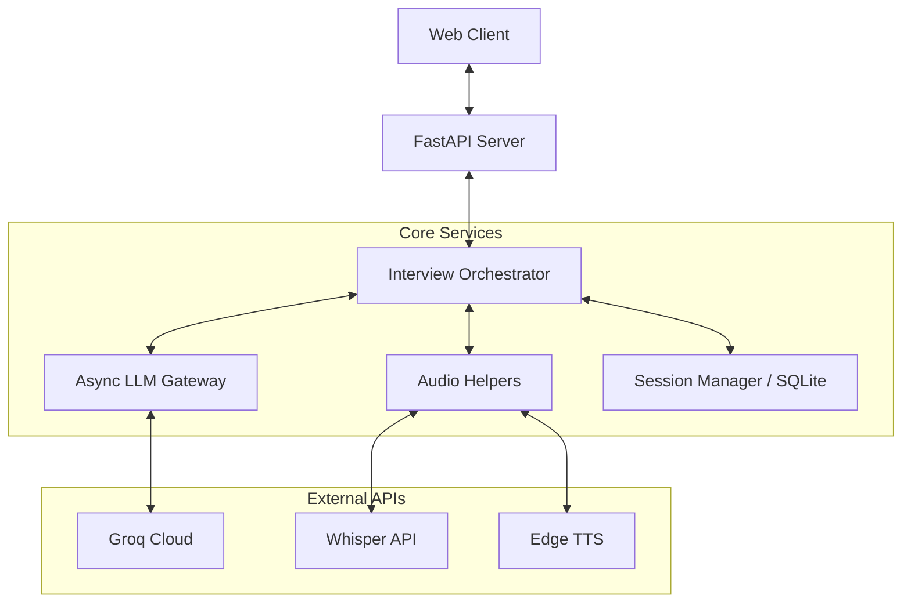
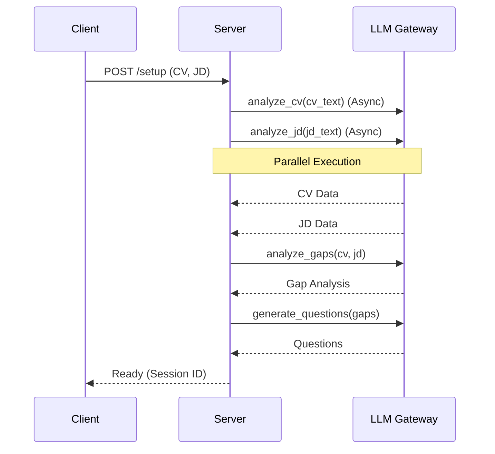

# NEXUS System Optimization & Architecture (v3.1)

This document reflects the current v2+ codebase and the remaining work needed
for a research-grade prototype. It avoids outdated statements from earlier
iterations and focuses on what is implemented vs. what still needs validation.

## 1. Current State (Implemented)

### A. Performance & Concurrency
- **Async I/O:** Server endpoints and LLM calls are async; CV/JD analysis runs in
  parallel using `asyncio.gather`.
- **Non-blocking file I/O:** Audio uploads are written with `aiofiles` to avoid
  blocking the event loop.
- **Session handling:** Multi-session state is managed via `SessionManager` and
  persisted to SQLite (optional JSON mirror for debugging).

### B. Reliability
- **Retries + backoff:** Groq API calls use exponential backoff with retries.
- **Key rotation:** Multiple Groq keys are rotated round-robin.
- **Fallback models:** The gateway can fall back if the primary model fails.

### C. Architecture
- **Layering in place:** API (FastAPI), Orchestrator, Gateway, and Pydantic data
  models are separated.
- **Type safety:** Structured outputs are validated against Pydantic models.

## 2. Remaining Risks / Gaps

### A. Research Validity
- **Scoring reliability:** Scores are LLM-generated. There is no inter-rater or
  human-labeled baseline yet.
- **STT error propagation:** Transcript errors can alter scoring outcomes.
- **Prompt sensitivity:** Small prompt changes can shift results; needs quantification.

### B. System Limits
- **Disk-based audio flow:** TTS output is file-based (cleaned up after response).
  Streaming STT/TTS is not implemented yet.
- **Concurrency constraints:** Async key rotation is not locked; under heavy
  concurrency, key usage may skew.

## 3. Optimization Strategy (Next Work)

### A. Evaluation & Reproducibility
- **Repeatability test:** Run 5-10 fixed interviews multiple times and report
  variance in scores and recommendations.
- **Logging for auditability:** Store model name, temperature, timestamps per run.
- **Human baseline:** Label a small sample with human scores and compare.

### B. Performance Enhancements
- **Optional streaming:** Evaluate streaming STT if latency becomes a bottleneck.
- **In-memory audio path:** Replace temporary files with in-memory buffers if
  the STT API supports it.

### C. Data Layer Improvements (Optional)
- **Structured schema:** Split SQLite tables into sessions, scores, and metrics
  for easier analysis and reporting.
- **Export pipeline:** Add a CSV/JSON export endpoint for research datasets.

## 4. Architecture (Current v2+)

### A. Layered Architecture
1. **Presentation Layer (API):** `nexus_server_v2.py`
2. **Orchestration Layer:** `nexus_core/orchestrator.py`
3. **Service Layer:**
   - `nexus_core/llm_gateway.py` (Groq API, retries, key rotation)
   - Audio helpers in `nexus_server_v2.py` (STT/TTS wrappers)
4. **Data Layer:** `nexus_core/structs.py` (Pydantic models)

### B. Data Flow
- **Setup:** API -> Orchestrator -> (Parallel) CV/JD -> Gap -> Questions -> Ready
- **Interview Loop:** Audio -> STT -> Orchestrator -> Score -> Next question -> TTS

## 5. Diagrams

### System Architecture

### Sequence: Setup Phase

## 6. Prompting & Output Consistency

- **Structured outputs:** Enforce JSON schemas with Pydantic validation.
- **Context pruning:** Limit history window to control token growth.
- **Error visibility:** Log raw model outputs on validation failure.

## 7. Reliability Framework (Current + Planned)

- **Key rotation:** Implemented (round-robin).
- **Exponential backoff:** Implemented.
- **Fallback models:** Implemented.
- **Streaming:** Not implemented (listed as future work).

## 8. Limitations (For Paper)

- LLM scoring is probabilistic and sensitive to prompt wording.
- STT errors can affect downstream scoring.
- No large-scale evaluation dataset yet; results are exploratory.
