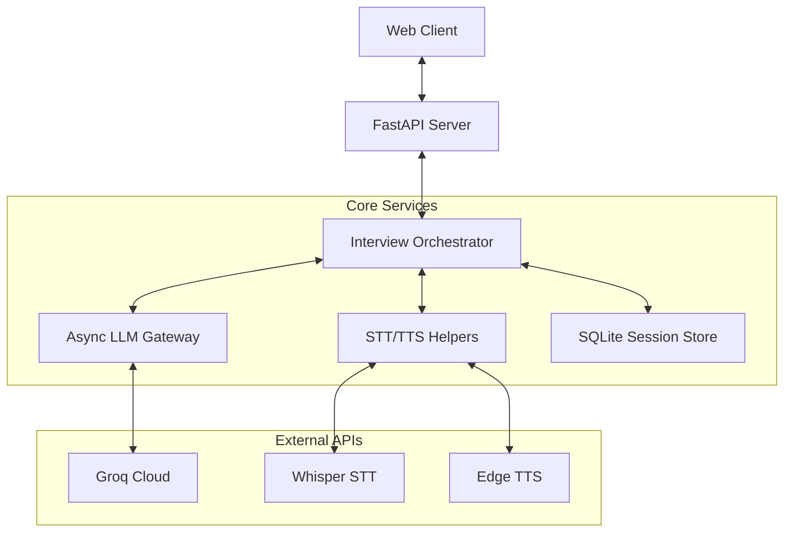

# 4. System Architecture

## 4.1 Overview

NEXUS is a FastAPI-based research system that orchestrates an audio interview
loop and produces structured evidence-grounded scores. The architecture
separates presentation, orchestration, services, and data models to ensure
traceability and reproducibility.

## 4.2 Layered Architecture

| Layer | Component | File | Responsibility |
| --- | --- | --- | --- |
| Presentation | API server | `nexus_server_v2.py` | Endpoints, UI serving, audio I/O |
| Orchestration | InterviewOrchestrator | `nexus_core/orchestrator.py` | Flow control, scoring, reporting |
| Service | LLM Gateway | `nexus_core/llm_gateway.py` | LLM calls, retries, fallback |
| Service | Audio helpers | `nexus_server_v2.py` | STT/TTS integration |
| Data | Pydantic models | `nexus_core/structs.py` | Typed schemas |
| Persistence | SQLite store | `nexus_core/storage.py` | Sessions + reports |

## 4.3 System Diagram

## 4.4 Runtime Flow

### Setup Phase
1. `/setup` accepts CV and JD.
2. LLM parses CV and JD in parallel.
3. LLM performs gap analysis.
4. LLM generates questions.
5. Session is marked `ready`.

### Interview Phase
1. `/chat` accepts audio.
2. STT transcribes audio.
3. Orchestrator scores response.
4. LLM generates next turn.
5. TTS returns audio response.

### Report Phase
1. `/report` aggregates scores.
2. Recommendation is generated.
3. Report is persisted in SQLite.

## 4.5 Persistence

Sessions and reports are stored as JSON blobs in SQLite for easy analysis.
Optional JSON mirroring is available for debugging.

## 4.6 Reliability Features

| Feature | Description |
| --- | --- |
| Retry + backoff | Automatic retry for transient failures |
| Key rotation | Multiple API keys are rotated round-robin |
| Model fallback | Automatic cascade on model failure |
| Schema validation | Pydantic validation for structured outputs |
